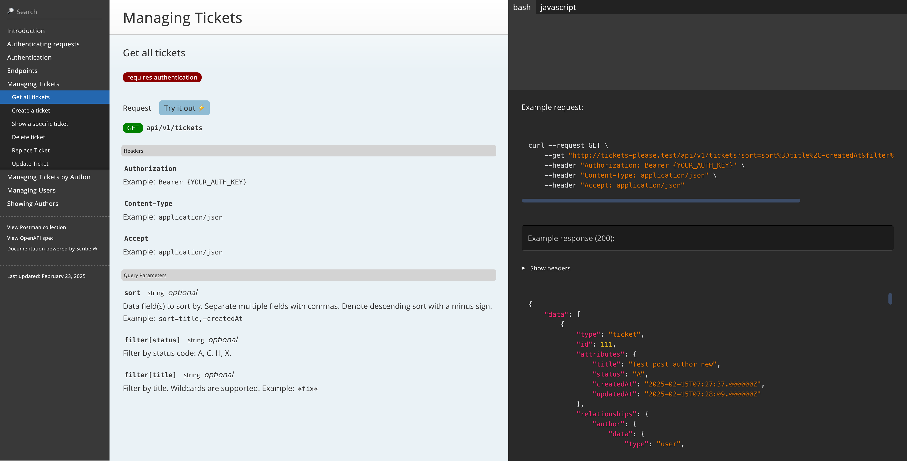

# Tickets Please

## Description

This project demonstrates a comprehensive approach to building robust RESTful APIs with Laravel. It showcases the development of a production-ready API from the ground up. The implementation covers essential aspects of modern API development, including thoughtful URL design, versioning strategies to maintain backward compatibility, and token-based authentication using Laravel Sanctum.

The project emphasizes structured response payloads through Laravel Resources, allowing for conditional data inclusion and relationship handling based on client needs. It implements sophisticated filtering and sorting mechanisms to give API consumers fine-grained control over the data they receive. The architecture supports complete CRUD operations with proper HTTP verb usage (GET, POST, PUT, PATCH, DELETE) following RESTful principles.

Beyond basic functionality, this API implements robust security measures through Laravel Policies and Sanctum token abilities, providing granular access control at both resource and attribute levels. The codebase follows the principle of least privilege and includes comprehensive error handling to ensure consistent JSON responses across all possible failure scenarios. The API is fully documented using Scribe, making it accessible and easy to consume for client developers.



## Stack

-   [Laravel](https://laravel.com/) - Laravel is a web application framework with expressive, elegant syntax. We believe development must be an enjoyable and creative experience to be truly fulfilling. Laravel attempts to take the pain out of development by easing common tasks used in most web projects.
-   [Scribe](https://scribe.knuckles.wtf/laravel) - Scribe helps you generate API documentation for humans from your Laravel codebase. See a live example at demo.scribe.knuckles.wtf. Features Useful output: Pretty single-page HTML doc, with human-friendly text, code samples, and in-browser API tester ("Try It Out") Generates Postman...

## Project structure

```
PROJECT_ROOT
├── .scribe                        # Directory for API documentation (Scribe)
├── app
│   ├── Enums                      # Enum classes for status types, etc.
│   │   └── StatusType.php         # Enum for ticket or user status
│   ├── Exceptions                 # Custom exception handling
│   │   └── Api                    # API-specific exception classes
│   │       └── V1                 # Version 1 API exceptions
│   │           └── ApiExceptions.php  # Custom API exception handling logic
│   ├── Http
│   │   ├── Controllers            # Controllers for handling requests
│   │   │   └── Api                # API-related controllers
│   │   │       └── V1             # Version 1 controllers
│   │   │           ├── ApiController.php  # General API controller
│   │   │           ├── TicketController.php  # Ticket-related API logic
│   │   │           └── UserController.php    # User-related API logic
│   │   ├── Filters                # Request filters (e.g., for querying tickets)
│   │   │   └── V1                 # Version 1 filters
│   │   │       ├── AuthorFilter.php      # Filter for authors
│   │   │       ├── TicketFilter.php      # Filter for tickets
│   │   │       └── QueryFilter.php       # General query filter
│   │   ├── Requests               # Form request validation
│   │   │   └── API                # API-specific requests
│   │   │       ├── V1             # Version 1 request validation
│   │   │       │   ├── StoreTicketRequest.php  # Validation for creating tickets
│   │   │       │   ├── StoreUserRequest.php    # Validation for creating users
│   │   │       │   └── UpdateTicketRequest.php  # Validation for updating tickets
│   │   └── Resources               # Resources to format API responses
│   │       └── V1                  # Version 1 resources
│   │           ├── TicketResource.php    # Formatting ticket data
│   │           └── UserResource.php      # Formatting user data
│   ├── Models                     # Eloquent models
│   │   ├── Ticket.php             # Ticket model
│   │   └── User.php               # User model
│   ├── Permissions                # Permissions for API actions
│   │   └── V1                     # Version 1 permissions
│   │       └── Abilities.php      # Define API abilities (CRUD actions)
│   ├── Policies                   # Policies for resource access control
│   │   └── v1                     # Version 1 policies
│   │       ├── TicketPolicy.php   # Authorization for ticket resources
│   │       └── UserPolicy.php     # Authorization for user resources
│   ├── Providers                  # Service providers
│   │   └── AppServiceProvider.php # Application-wide service provider
│   └── Traits                     # Helper traits
│       └── ApiResponses.php       # Trait for consistent API responses
├── bootstrap
│   └── app.php                    # Application bootstrapping
├── config
│   └── scribe.php                 # Scribe configuration for API documentation
├── database
│   ├── factories                  # Model factories for testing and seeding
│   ├── migrations                 # Database migration files
│   └── seeders                    # Database seeding
└── routes
    ├── api.php                    # API route definitions
    └── api_v1.php                 # Version 1 API routes
```